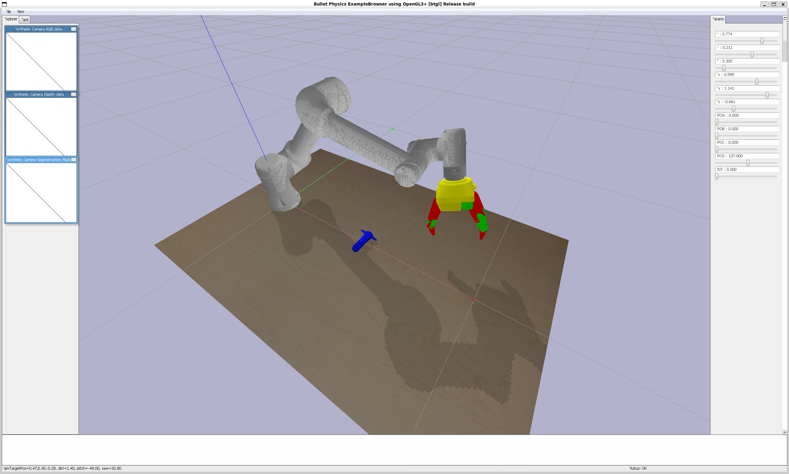

# UR5e-Robotiq-3F-Gripper-Pybullet-Simulation

A collection of UR5e manipulator and Robotiq 3 finger gripper simulation on PyBullet

## Must-Know
The gap between manipulator and gripper is not accurate.\
To simulate more accurately, you should modify the y value of the origin of the joint `ee_fixed_joint` in `ur5e-gripper.urdf` by yourself.

## `ur5e-gripper.py`
Move UR5e manipulator via x, y, z coordinates inputs.\
Move fingers of Robotiq 3-finger gripper via register inputs.

## `gripper_joint_control_degree.py`
Move fingers of Robotiq 3-finger gripper via degree inputs.

## `gripper_joint_control_register.py`
Move fingers of Robotiq 3-finger gripper via register inputs.

## TODO
- Fix abnormal motion of gripper when in contact with other objects.
- Implement adaptive grasping simulation.
